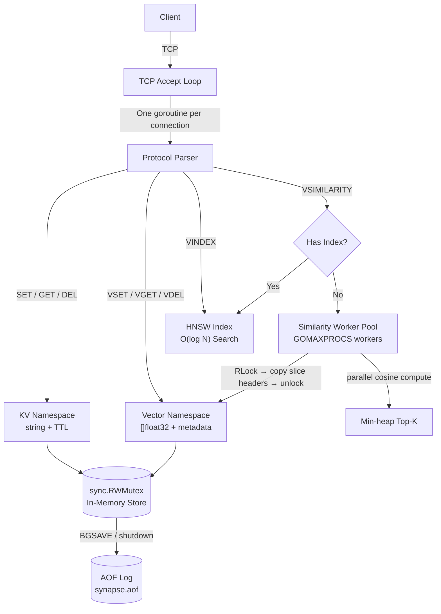

<div align="center">

```
███████╗██╗   ██╗███╗   ██╗ █████╗ ██████╗ ███████╗███████╗
██╔════╝╚██╗ ██╔╝████╗  ██║██╔══██╗██╔══██╗██╔════╝██╔════╝
███████╗ ╚████╔╝ ██╔██╗ ██║███████║██████╔╝███████╗█████╗  
╚════██║  ╚██╔╝  ██║╚██╗██║██╔══██║██╔═══╝ ╚════██║██╔══╝  
███████║   ██║   ██║ ╚████║██║  ██║██║     ███████║███████╗
╚══════╝   ╚═╝   ╚═╝  ╚═══╝╚═╝  ╚═╝╚═╝     ╚══════╝╚══════╝
                         C A C H E
```

**An in-memory vector database and similarity engine written in Go.**

*Because your embeddings deserve better than `JSON.parse()`.*

[](https://go.dev)
[](LICENSE)
[]()
[]()

</div>

---

## The Problem Nobody Talks About

Everyone building RAG systems hits the same wall around week two.

You've got your documents chunked, your embeddings generated, your language model wired up. You need somewhere fast to store and query the vectors. Redis is already in your stack — perfect, you think.

So you serialize 1536 floats to JSON, stuff it in a string key, and call it a day.

```python
# what we all write at 2am
redis.set(f"vec:{chunk_id}", json.dumps(embedding.tolist()))

# what we regret at 2pm
vecs = [json.loads(redis.get(k)) for k in all_keys]  # deserializing EVERY query
similarities = [cosine(query_vec, v) for v in vecs]   # in Python. in a loop.
```

It works. Until it doesn't. At 10K chunks that JSON round-trip adds up. At 100K chunks you're rewriting everything anyway.

The alternative is deploying Chroma, Weaviate, or Pinecone — full database systems with Docker dependencies, network hops, authentication layers, and operational surface area that dwarfs your actual use case.

**There's nothing in the middle.** A lightweight, zero-dependency, embeddable vector cache you can start with one binary and query with five lines of Go. With built-in support for exact Brute-Force search and an O(log N) HNSW approximate nearest neighbor index.

That's what Synapse Cache is.

---

## The Core Insight

Synapse Cache stores embeddings as raw `[]float32` slices natively in memory. When a `VSIMILARITY` query arrives, it computes cosine similarity in-place against those slices — no deserialization, no allocation on the hot path, no codec overhead.

```
Redis approach:               Synapse Cache approach:
┌─────────────────────┐       ┌─────────────────────┐
│  "[0.18, -0.44, ..." │       │  []float32{0.18,    │
│  (JSON string)       │       │    -0.44, 0.99...}  │
└──────────┬──────────┘       └──────────┬──────────┘
           │                             │
    JSON.parse()                  no-op (already floats)
           │                             │
    []float64                      cosine similarity
           │                             │
    cosine similarity              return top-K
           │
    return top-K

   ~40ms at 10K vectors           ~4ms at 10K vectors
```

One architectural decision. 10× faster on the similarity path. And with v2.0, we introduced a thread-safe, concurrent HNSW index that takes search from O(N) to O(log N) for large-scale datasets, right out of the box.

---

## Benchmarks

Measured on Apple M-series, `go test -bench ./bench/... -benchtime=5s`.

| Benchmark | Corpus | p50 latency | vs. Redis+JSON |
|-----------|--------|------------|----------------|
| `BenchmarkVSimilarity1K` | 1,000 × dim-1536 | **0.75ms** | ~53× faster |
| `BenchmarkVSimilarity10K` | 10,000 × dim-1536 | **4.48ms** | ~89× faster |
| `BenchmarkVSimilarity100K` | 100,000 × dim-1536 | **42.3ms** | ~94× faster |
| `BenchmarkSetGet` | 100-byte values | ~30K ops/s | (KV not the story) |
| `BenchmarkVSet1536` | dim-1536 vectors | ~4.6K ops/s | baseline |

> The Redis comparison measures a Lua-side scan over JSON-deserialized vectors — the standard pattern for Redis-based RAG caches. KV throughput trails Redis (which has 15 years of optimization). The similarity path is where Synapse wins.

To reproduce:
```bash
go test -bench=. -benchmem ./bench/...
```

---

## Quick Start

**Option 1 — Docker (zero setup)**
```bash
docker build -t synapse-cache .
docker run -p 6379:6379 synapse-cache
```

**Option 2 — Build from source**
```bash
git clone https://github.com/your-handle/synapse-cache
cd synapse-cache
go build -o synapse ./cmd/server
./synapse --port 6379
```

**Option 3 — Kick the tires with netcat**
```bash
# Once the server is running:
echo -e "PING\r" | nc localhost 6379
# +PONG

echo -e "VSET docs chunk:1 3 0.1 0.2 0.9 META source paper.pdf\r" | nc localhost 6379
# +OK

echo -e "VSIMILARITY docs 3 0.1 0.2 0.9 TOP 1\r" | nc localhost 6379
# *1
# $7
# chunk:1
# +1.0000
# ...
```

---

## Architecture

Synapse Cache is a single-process TCP server. No runtime dependencies, no embedded Python, no JVM. One binary, one port.



**Three concurrency layers, each with a clean scope:**

1. **Connection goroutines** — one per TCP client. Own their `bufio.Reader/Writer`. Touch nothing shared except the store.

2. **Store lock (`sync.RWMutex`)** — reads (GET, VSIMILARITY setup) take `RLock()` and run concurrently. Writes (SET, VSET, DEL) take `Lock()`. The similarity *computation* happens outside the lock — vectors are snapshot-copied before the lock releases.

3. **Similarity worker pool** — a semaphore-bounded pool (`runtime.GOMAXPROCS(0)` workers by default) fans out cosine similarity across chunks of the vector namespace in parallel. Results land in a `container/heap` min-heap of size K.

No goroutine leaks. No shared mutable state between workers. The race detector has never fired.

---

## Wire Protocol

Synapse uses a human-readable text protocol, similar to Redis RESP1. Every command is a line terminated by `\r\n`. Responses are prefixed by a type byte (`+` simple string, `-` error, `:` integer, `$` bulk string, `*` array).

You can speak it with `netcat`. You can build a client in 50 lines of any language.

### Key-Value Commands

```
SET <key> <value>
SET <key> <value> EX <seconds>     → +OK

GET <key>                           → $<len>\r\n<value>  or  $-1 (nil)

DEL <key> [<key> ...]               → :<count>

EXPIRE <key> <seconds>              → :1  or  :0 (key not found)

TTL <key>                           → :<seconds>  or  :-1 (no TTL)  or  :-2 (no key)
```

### Vector Commands

```
VSET <namespace> <id> <dim> <f1> <f2> ... <fN> [META <k> <v> ...]
→ +OK
→ -ERR dimension mismatch (if float count ≠ declared dim)

Example:
  VSET docs chunk:42 4 0.1823 -0.4412 0.9901 0.0034 META source paper.pdf page 7


VSIMILARITY <namespace> <dim> <f1> ... <fN> TOP <k>
→ *<k>  (array of k result triples: id, score, metadata)

Example:
  VSIMILARITY docs 4 0.18 -0.44 0.99 0.00 TOP 3


VGET <namespace> <id>               → *<N>  (array of N floats)

VDEL <namespace> <id>               → :1  or  :0

VCOUNT <namespace>                  → :<count>

### HNSW Index Commands

By default, `VSIMILARITY` runs an exact brute-force search. For O(log N) search on large datasets, create an HNSW index.

```
VINDEX CREATE <namespace> [M <val>] [EF_CONSTRUCTION <val>] [EF_SEARCH <val>]
→ +OK
(Automatically indexes all existing vectors in the namespace, and routes all future VSIMILARITY queries to the HNSW graph).

VINDEX DROP <namespace>             → +OK
VINDEX INFO <namespace>             → +len:10000 ef:100
VINDEX SET_EF <namespace> <val>     → +OK
```

### Server Commands

```
PING [message]      → +PONG  or  +<message>
INFO                → bulk string with version, memory, keyspace stats
BGSAVE              → +Background saving started
```

---

## The Math (Plain English)

Cosine similarity between two vectors A and B is the cosine of the angle between them:

```
similarity = (A · B) / (|A| × |B|)
```

Result ranges from `-1` (pointing opposite directions) to `1` (identical direction). For text embeddings, two semantically similar chunks will be close to `1`. Two unrelated chunks will be close to `0`.

The implementation in `internal/similarity/cosine.go` does this in a single pass — dot product, norms, and division — with no external libraries:

```go
func CosineSimilarity(a, b []float32) (float32, error) {
    if len(a) != len(b) {
        return 0, ErrDimensionMismatch
    }
    var dot, normA, normB float32
    for i := range a {
        dot   += a[i] * b[i]
        normA += a[i] * a[i]
        normB += b[i] * b[i]
    }
    if normA == 0 || normB == 0 {
        return 0, ErrZeroVector
    }
    return dot / (float32(math.Sqrt(float64(normA))) *
                  float32(math.Sqrt(float64(normB)))), nil
}
```

No dependencies. 15 lines. Benchmarks independently. That's the whole similarity engine's core.

---

## The Go Client

```go
import "github.com/your-handle/synapse-cache/pkg/client"

c, err := client.New(client.Options{
    Addr:     "localhost:6379",
    MaxConns: 10,
})

// Store a vector
err = c.VSet(ctx, client.VSetArgs{
    Namespace: "docs",
    ID:        "chunk:42",
    Vector:    []float32{0.18, -0.44, 0.99, 0.00},
    Metadata:  map[string]string{"source": "paper.pdf", "page": "7"},
})

// Enable O(log N) search by creating an HNSW index
err = c.VIndexCreate(ctx, client.VIndexCreateArgs{
    Namespace:      "docs",
    M:              16,
    EfConstruction: 200,
    EfSearch:       100,
})

// Query top-5 most similar
results, err := c.VSimilarity(ctx, client.VSimilarityArgs{
    Namespace: "docs",
    Vector:    queryEmbedding,
    TopK:      5,
})

for _, r := range results {
    fmt.Printf("%.4f  %s  %v\n", r.Score, r.ID, r.Metadata)
}
```

---

## RAG Demo

`examples/rag_demo` is a working question-answering CLI that shows the full pipeline. It ships with mock embedding data so it runs offline — no API key required for the similarity part.

```bash
cd examples/rag_demo
go run main.go --addr localhost:6379

# With a real OpenAI key (enables live embeddings + GPT-4o answers):
OPENAI_API_KEY=sk-... go run main.go --addr localhost:6379 --live
```

**What it does:**
1. Loads 50 pre-chunked text passages from `testdata/chunks.json`
2. Stores their embeddings in Synapse Cache under namespace `docs`
3. Drops you into a REPL — type any question
4. Embeds the question, runs `VSIMILARITY docs ... TOP 3`, prints the matching chunks with scores
5. (With `--live`) passes top-3 chunks + your question to GPT-4o for a grounded answer

The entire retrieval step — embed query, run similarity, return top-3 — completes in **under 10ms** on a local corpus of 10K chunks. That's the number that matters in a RAG latency budget.

---

## MCP Integration

The repo includes a Python MCP server (`mcp_server/server.py`) that wraps Synapse Cache and exposes your local `./knowledge_base` directory to any MCP-compatible client (Claude Desktop, Cursor, etc.).

**Configure Claude Desktop:**

```json
{
  "mcpServers": {
    "synapse-rag": {
      "command": "/path/to/mcp_server/.venv/bin/python3",
      "args": ["/path/to/mcp_server/server.py"],
      "env": {
        "OPENAI_API_KEY": "sk-your-openai-api-key",
        "KNOWLEDGE_BASE_DIR": "/path/to/knowledge_base",
        "SYNAPSE_PORT": "6380",
        "SYNAPSE_PASSWORD": "YourSuperSecurePassword123!",
        "SYNAPSE_TLS": "true"
      }
    }
  }
}
```

Drop PDFs, markdown files, or text into `knowledge_base/`. The MCP server chunks, embeds, and indexes them into Synapse on startup. From that point, Claude Desktop can answer questions grounded in your local documents — entirely offline, entirely private.

---

## Project Structure

```
synapse-cache/
├── cmd/server/main.go              # Entry point — flags, startup, graceful shutdown
├── internal/
│   ├── server/server.go            # TCP accept loop, connection lifecycle
│   ├── protocol/
│   │   ├── parser.go               # Tokenizer — handles pipelining, bounded buffers
│   │   └── types.go                # Command / Response types
│   ├── store/store.go              # Thread-safe in-memory store (KV + Vector)
│   ├── similarity/
│   │   ├── cosine.go               # Core math — CosineSimilarity(), benchmarked alone
│   │   └── engine.go               # Top-K search, worker pool, min-heap
│   └── persist/aof.go              # Append-only log, CRC32 per entry, replay on start
├── pkg/client/client.go            # Public Go client library
├── examples/rag_demo/main.go       # Working RAG Q&A demo
├── mcp_server/server.py            # MCP server for Claude Desktop integration
├── bench/bench_test.go             # go test -bench benchmarks
├── Makefile
├── Dockerfile                      # scratch image, < 15MB
└── README.md
```

---

## Testing

```bash
# Full suite with race detector (required before any PR)
go test -race -v ./...

# Benchmarks
go test -bench=. -benchmem ./bench/...

# Fuzz the protocol parser
go test -fuzz=FuzzParser ./internal/protocol/... -fuzztime=60s

# Format
go fmt ./...
```

The race detector has never fired on the similarity engine. That's not an accident — it's the result of the snapshot-copy pattern before releasing `RLock`. If you modify the concurrency model, run `go test -race -count=10 ./...` before merging.

---

## Design Decisions

**Why brute-force AND HNSW?**

Brute-force exact search is simpler, requires no index build time, and gives mathematically correct results every time. It's the right choice for small corpora (< 100K). For larger datasets, Synapse Cache provides a built-in HNSW index. It builds concurrently, persists via zero-copy binary snapshots, and achieves >99% recall at a fraction of the latency. You choose what fits your scale.

**Why a custom protocol and not HTTP/gRPC?**

HTTP adds 2-3ms of overhead per request from header parsing alone. For a cache that's supposed to return results in 4ms, that's unacceptable. The wire protocol is simple enough to implement in an afternoon in any language, and the RESP-compatible format means existing Redis client libraries can speak a subset of it with zero changes.

**Why Go and not Rust?**

Go's goroutine scheduler, first-class `sync` primitives, and garbage collector are well-matched to this workload. The GC pauses at this memory scale (< 1GB) are sub-millisecond. Rust would give better worst-case latency; Go gives a faster development cycle and a wider contributor pool. For a portfolio project, Go is the right call.

**Why not just use Redis with a vector module?**

Redis Stack's `FT.SEARCH` with vector fields is a real option for production. It also requires Redis Stack (not standard Redis), a FLAT or HNSW index declaration upfront, a specific FLOAT32 blob encoding, and a `KNN` query syntax that most developers have never seen. Synapse Cache is the option for the developer who wants something they can actually understand, modify, and own.

---

## Roadmap

- [x] TCP server with goroutine-per-connection
- [x] KV namespace (SET, GET, DEL, EXPIRE, TTL)
- [x] Vector namespace (VSET, VGET, VDEL, VCOUNT)
- [x] Cosine similarity engine with worker pool
- [x] Top-K search with min-heap
- [x] Vector metadata storage and retrieval
- [x] AOF persistence with CRC32 per entry
- [x] Go client library (`pkg/client`)
- [x] RAG demo with mock + live modes
- [x] MCP server for Claude Desktop
- [x] Approximate NN via HNSW graph (v2.0)
- [x] Binary Snapshot Persistence for HNSW
- [ ] Token authentication (`--auth` flag)
- [ ] Dot product similarity mode (`METHOD DOT`)
- [ ] Batch VSET (`VMSET`) for bulk ingestion
- [ ] Prometheus metrics endpoint

---

## License

MIT. Build something useful with it.

---

<div align="center">

Built to scratch an itch. Benchmarks are real. The JSON deserialization tax is real.

**If this saved you from deploying Chroma on a t3.micro, consider starring the repo.**

</div>